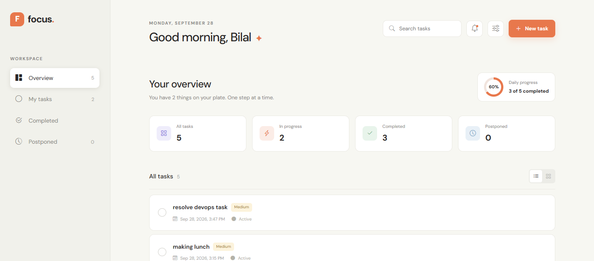

# 🔔 Todo Notification App

A modern Todo Management application built with **React** and **Supabase** that helps users organize tasks, manage deadlines, and receive reminders before tasks become overdue.

The application supports task management, due dates, authentication, and automatic reminder notifications.

## 📸 Application Preview



## ✨ Features

- 🔐 User Authentication
- ➕ Create Tasks
- ✏️ Edit Tasks
- 🗑️ Delete Tasks
- ✅ Mark Tasks as Complete
- 📅 Task Due Dates and Times
- 🔔 Task Reminder Notifications
- 📧 Email Notification Support
- ⏰ 1 Hour Before Due Date Reminder
- ⏱️ 30 Minutes Before Due Date Reminder
- 🚫 Prevents Notifications for Completed Tasks
- ☁️ Supabase Backend
- 📱 Responsive React Interface

## 🔔 Notification Logic

The application checks incomplete tasks and sends reminders before their due date.

For example, if a task is due at **5:00 PM**:

- A reminder can be sent at **4:00 PM** — 1 hour remaining.
- Another reminder can be sent at **4:30 PM** — 30 minutes remaining.
- If the task has already been completed, the reminder is not sent.

This helps users complete tasks before their deadlines and remember to mark them as completed.

## 🛠️ Tech Stack

### Frontend

- React
- JavaScript
- Vite
- HTML
- CSS

### Backend

- Supabase
- PostgreSQL
- Supabase Authentication
- Supabase Database

### Notifications

- Email reminders
- In-app notification logic

## 📂 Project Structure

```text
todo-notification-app/
├── assets/
│   └── APP_View.png
├── public/
├── src/
│   ├── components/
│   ├── pages/
│   ├── services/
│   └── ...
├── supabase/
├── .env.example
├── .gitignore
├── package.json
├── README.md
└── vite.config.js
```

The exact structure may vary depending on the current version of the application.

## 🚀 Getting Started

### 1. Clone the Repository

```bash
git clone https://github.com/bilalrasheed922/Todo_APP_With_Notification_logic.git
```

Move into the project directory:

```bash
cd Todo_APP_With_Notification_logic
```

### 2. Install Dependencies

```bash
npm install
```

### 3. Configure Environment Variables

Create a `.env` file in the project root.

```env
VITE_SUPABASE_URL=your_supabase_project_url
VITE_SUPABASE_ANON_KEY=your_supabase_publishable_key
```

Do not commit your real `.env` file or private credentials to GitHub.

### 4. Start the Application

```bash
npm run dev
```

Open the local URL displayed by Vite, typically:

```text
http://localhost:5173
```

## 🗄️ Supabase Setup

This project uses Supabase for backend functionality.

To run your own instance, configure:

1. A Supabase project
2. Authentication
3. Todo/task tables
4. Notification/reminder tables
5. Row Level Security policies
6. Required Edge Functions or scheduled jobs
7. Email provider configuration, if email notifications are enabled

Add the required Supabase URL and publishable key to your local `.env` file.

## 🔐 Security

Sensitive credentials should never be committed to this repository.

Keep values such as the following private:

- Supabase service role key
- Email API keys
- Database credentials
- Other server-side secrets

Frontend environment variables should only contain values that are safe to expose to the browser.

Supabase Row Level Security (RLS) should be enabled and configured so users can access only their own application data.

## 🧪 Build

Create a production build with:

```bash
npm run build
```

You can preview the production build with:

```bash
npm run preview
```

## 🔮 Future Improvements

Potential future features include:

- 🔁 Recurring Tasks
- 🏷️ Categories and Tags
- 🚩 Task Priorities
- 📋 Subtasks
- 📊 Productivity Dashboard
- 📆 Calendar View
- 🔍 Advanced Search and Filters
- 💤 Snooze Reminders
- 🔔 Browser Push Notifications
- 📱 Progressive Web App (PWA) Support
- 🌙 Dark Mode

## 🤝 Contributing

Contributions, suggestions, and improvements are welcome.

Fork the repository, create a feature branch, make your changes, and submit a pull request.

## 📄 License

This project is available for educational and personal use.
